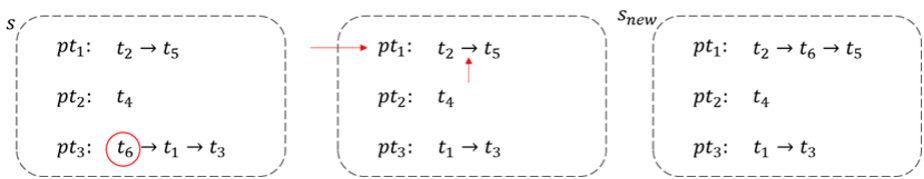

# Introduction

Regression testing is a basic and crucial method for the detection of faults in an evolving software for ensuring its quality. While there is no doubt that regression testing is very important, it comes with a time cost. One of the solutions studied for this problem is test prioritization. The main idea is to find an execution order for the tests that allow for the earlier detection of faults. In the industry, it is common to see that development teams increase the number of computing resources to balance out time costs. In our research, we explore how the tests can be scheduled across a cluster of machines, possibly of different computing power, in a way that allows earlier fault detection - or put shortly, parallel test prioritization. We provide an empirical evaluation, comparison, and analyses of three different parallel test prioritization approaches - genetic algorithm, simulated annealing, and greedy algorithms.

![An Example for Parallel Test Prioritization [@zhou_parallel_2021]](./img/example.png){width=80%}

# Problem Description

We define the Parallel Test Prioritization with Relative Performance based on the previous study [@zhou_parallel_2021].

**Parallel Test Prioritization with Relative Performance.** Given a test suite $T$, the number of parallel test sequences $c$, and the relative performances of the sequences $p=[p_1, p_2, \dots,p_c]$, its set of parallel permutations PPT can be represented by $PPT = \{ [pt_1, \dots, pt_c] │ \forall pt_s \in Permutation(TT_s) (1 \le s \le c) \quad \textrm{where} \quad TT_i \subset T \wedge TT_i \ne \emptyset \wedge \cup_{1 \le i \le c} TT_i = T \wedge TT_i \cap TT_j= \emptyset \quad (1 \le i, j \le c \wedge i \ne j)\}$ where $Permutation(TT_s)$ represents the permutation on test suite $TT_s$. Suppose that an objective function $f$ that maps a parallel permutation to a real number, a constraint function $g$ that maps a parallel permutation to a real number, and the time constraint $TC$, the parallel test prioritization with relative performance problem is to find $T' \in PPT$ satisfying $g(T') \le TC \wedge \forall T'' \in PPT∶ [g(T'') \le TC \wedge f(T') \ge f(T'') \wedge T'' \ne T']$.

The constraint function $g$ that we used is the maximum execution time of the test sequence. Execution time of the test sequence $pt_s$, $t_s$, can be computed as below equation.

$$t_s = \sum\limits_{y=1}^{l_s} \frac{ti_{s,y}}{p_s}$$

Here, $l_s$ means the number of tests in $pt_s$ and $ti_{s,y}$ means the testing time of $y$th test in the test sequence $pt_s$. Then $g$ can be defined as below equation.

$$g(T') = \max\limits_{s} (t_s)$$

For the objective function $f$, we changed average percentage statement coverage, $APSC_c$, from the previous study [@zhou_parallel_2021] to consider the relative performances as below equation.

$$APSC_{c}=\frac{\sum_{z=1}^{m}\left(\sum_{s=1}^{c} \sum_{y=1}^{l_{s}} t i_{s, y}-\sum_{y=1}^{T S_{s, z}} \frac{t i_{s, y}}{p_{s}}+\frac{1}{2} \frac{ti_{s, TS_{s,z}}}{p_s}\right)}{m\left(\sum_{s=1}^{c} \sum_{y=1}^{l_{s}} t i_{s, y}\right)}$$

$m$ denotes total number of statement coverage. This measure calculates how fast the test covers all the coverages. Let's say $z$th statement is covered first in a test sequence, $pt_s$. Then $TS_{s,z}$ means the rank of $z$th statement in $pt_s$. We can measure how long it takes to cover $z$th statement using the formula $\sum_{y=1}^{T S_{s, z}} \frac{t i_{s, y}}{p_{s}} - \frac{1}{2} \frac{ti_{s, TS_{s, z}}}{p_{s}}$. Also, $\sum_{s=1}^{c} \sum_{y=1}^{l_{s}} t i_{s, y}$ means sum of execution time of all the test cases. Therefore, $APSC_c$ can measure how fast the test covers all the statements in percentage form.

# Algorithms

This section describes the three algorithms used in the experiments.

## Greedy Algorithms \label{greedy}

As a first approach, for comparison, we have implemented deterministic greedy algorithms.

The first step is to initialize the parallel test prioritization. Let's assume there is some assignment of tests to computing resources. Let $avgtime$, a variable, be a weighted sum of tests processing time on each computing resource divided by the number of computing resources. Then, tests are divided into two groups - in the first group, the duration of each test is less than $avgtime$ and in the second group, the duration of each test is bigger or equal to $avgtime$. We assign each test in the second group a separate computing resource, starting from the most performant.

Let $TC$ be the time constraint that each of the computing resources should respect. Time constraint and $avgtime$ calculation procedure are as follows:

1. Create a queue for each computing resource.
2. Initialize the total duration of each queue to 0 seconds.
3. Sort all durations so that the longest one comes first.
4. Put each duration in the queue that ends first. If there are multiple queues with a minimum total duration, place the duration in the queue with the best performance.
5. Update the total duration of that queue. `T += duration / performance`
6. Repeat steps 4 and 5 until there is no more duration left.
7. Find the time it takes for all the queues to finish. We will use this as $avgtime$.
8. $TC = 1.5 * avgtime$

For greedy algorithms, we considered both cost-unaware and cost-aware parallel test prioritization. Both of them have total greedy and additional greedy algorithms, having minor differences.

Cost-unaware total greedy simply sort tests in descending order by the number of lines of code they cover. The difference with the cost-aware version is that the latter sorts by the number of covered lines divided by the duration of the test, so it takes into account the time as well.

Cost-aware total greedy at each step picks the test that covers most of the yet uncovered lines. And the same as the previous argument applies to cost-aware additional greedy.

## Simulated Annealing

Simulated annealing (SA) is a local search algorithm that increases exploration by introducing a concept of temperature and cooling schedule. We applied SA for the Parallel Test Prioritization Problem like Figure \ref{SAP}.

{width=50%}

The SA algorithm generates an initial candidate randomly. Next, it initializes the temperature $T$ as 1. To get a random neighbor of a $T' \in PPT$, we followed the procedure below.

1. Select a random test case from the entire test sequences and remove the test case in the sequence.
2. Select a random test sequence $pt_s$ to insert the removed test case.
3. Select a random location in the test sequence $pt_s$ and insert the removed test case in the location.

Figure \ref{GEN} shows the example of generating a random neighbor. It removed a test $t_6$ and inserted it between $t_2$ and $t_5$ in the test sequence $pt_1$.

{width=90%}

We used $APSC_c$ as the fitness function, $F$. Also, we used an exponential cooling schedule to decrease temperature. We multiplied 0.99 to the temperature when each iteration ends. Finally, we set the number of total iterations $n$ to be 2000.

## Genetic Algorithms

Genetic algorithm (GA) represents a class of adaptive search techniques based on the processes of natural genetic selection according to the Darwinian theory of biological evolution. Figure \ref{GAS} shows a typical GA procedure. GA first randomly generates a set of individuals as the initial population. Each individual is represented by a permutation of the test suite. It then uses a fitness function to select suitable individuals as the parent for producing the next generation. Next, it applies crossover and mutation operators to the selected parents to generate the offspring. The crossover operator randomly selects a crossing position and crosses two parents to create two new individuals while the mutation operator mutates an individual by exchanging the positions of two tests that are randomly selected. The above process, except the initialization step, is repeated until the termination condition is reached.

![Genetic Algorithm Structure [@li_search_2007] \label{GAS}](./img/genetic.png){width=50%}

We applied the GA with the following parameters and strategies. Population size is set to 100 and the algorithm terminates when it reaches the 100th generation. For the selection strategy, tournament selection is used. The best individual is picked among the 10 individuals which are randomly selected from the population. This selection process is repeated until the desired number of parents, which is set to 20, are selected. So, each generation is evaluated by the fitness function ($APSC_c$), and 20 parents are selected without replacement.

Also, genetic operators are designed to fit the parallel scenario. Figure \ref{CXO} describes the crossover operator. P1 and P2 are parents and O1 and O2 are offspring generated by applying the crossover operators. Supposed that the total execution time of the test sequences P1 and that of P2 are denoted as time(P1) and time(P2). First, the crossover operator selects a crossing point, which is a random time between 0 and maximum of time(P1) and time(P2), shown by the red line in the figure. All the tests whose execution ends before the crossing point remain the same positions in offspring. Then, seq1 is produced by the remaining tests of P1 based on the ascendant order of their starting time in P2. And seq2 is produced by remaining tests of P2 based on the ascendant order of their starting time in P1. Finally, each test is selected from seq1 according to the order and is added to the end of the test sequence in O1 with the smallest execution time. The same works for seq2 and O2. The values in the dotted circle represent the order of tests being added to offspring.

![Crossover operator in genetic algorithm for parallel test prioritization [@zhou_parallel_2021] \label{CXO}](./img/crossover.png){width=80%}

The mutation operator first randomly selects a test sequence in an individual, then randomly selects two tests in this test sequence, and finally exchanges their positions. Note that the mutation rate was set to 0.1.

One thing to be careful of is that only the individuals that satisfy the given time constraint can be inherited to the next generation. Thus, we have to check whether each individual satisfies the time constraint during initialization or after crossover. (The mutation operator we defined does not change the execution times of the test sequences so that there is no need to check the constraint after mutation.) Individuals which do not satisfy the time constraint should be discarded.

# Experimental Design

This section describes the family of empirical studies performed, including the design and subjects.

## Research Questions

The following two research questions motivated this study:

- **RQ1**: Which algorithm produces the best solution for the parallel test prioritization problem?
- **RQ2**: How does the number of computing resources and the relative performance between them influence the result of the parallel test prioritization?

These two questions concern the quality of parallel regression testing. The first question is about the quality of the solution, and the second question is about how performance imbalance affects the quality of regression testing.

\pagebreak

## Subjects

We referred to many existing studies [@zhou_parallel_2021;@luo_how_2019;@chen_optimizing_2018] that target Java code coverage like our research. Each of the studies targeted about 50 Java programs, and we were able to get a list of 84 programs by combining them and removing duplicates. In this study, we used 27 open-source Java projects from GitHub. All projects are built on Maven and are suited with tests in the JUnit testing framework. For each subject, we used OpenClover^[[https://openclover.org](https://openclover.org)] to collect its dynamic coverage and used SLOC^[[https://github.com/flosse/sloc](https://github.com/flosse/sloc)] to collect its basic information (i.e., lines of source code).

| **ID** | **Subjects**        | **SLOC** | **#Test** | **Time (s)** |
| -----: | :------------------ | -------: | --------: | -----------: |
|      1 | commons-cli         |    9,053 |       192 |        3.064 |
|      2 | dictomaton          |    4,318 |        53 |       14.067 |
|      3 | disklrucache        |    1,921 |        61 |        2.364 |
|      4 | efflux              |    5,633 |        40 |        0.581 |
|      5 | exp4j               |    5,699 |       311 |       11.350 |
|      6 | gdx-artemis         |    3,607 |        35 |        0.483 |
|      7 | geojson-jackson     |    1,569 |        60 |        1.284 |
|      8 | gson-fire           |    3,566 |        91 |        3.249 |
|      9 | jactor              |    6,984 |        60 |       11.628 |
|     10 | jadventure          |    5,276 |        74 |        2.311 |
|     11 | jarchivelib         |    2,256 |        33 |        0.217 |
|     12 | java-faker          |    8,541 |       571 |       34.154 |
|     13 | java-uuid-generator |    4,321 |        46 |        0.937 |
|     14 | javapoet            |    9,874 |       346 |       15.323 |
|     15 | jsonassert          |    3,476 |       150 |        1.641 |
|     16 | jumblr              |    2,970 |       103 |        0.905 |
|     17 | lastcalc            |    7,271 |        34 |       13.672 |
|     18 | low-gc-membuffers   |   13,099 |        51 |        1.784 |
|     19 | metrics             |    6,493 |        76 |       43.964 |
|     20 | mp3agic             |   10,037 |       495 |        4.815 |
|     21 | nv-websocket-client |    8,617 |        73 |        1.014 |
|     22 | protoparser         |    5,545 |       171 |        4.752 |
|     23 | restfixture         |    8,243 |       290 |        6.716 |
|     24 | skype-java-api      |    9,749 |        24 |       15.720 |
|     25 | stateless4j         |    2,728 |        88 |        2.146 |
|     26 | stream-lib          |    8,756 |       142 |      443.206 |
|     27 | xembly              |    3,030 |        63 |        6.834 |

Table: Basic Information of Open-Source Subjects from GitHub

\pagebreak

## Settings

According to the definition, parallel test prioritization has two unique inputs, the relative performances of computing resources $p$ and the time constraint $TC$. These inputs influence the performance of parallel test prioritization. To evaluate their influences, in the empirical study, we designed various scenarios considering computing environments for regression testing. We set the time constraint $TC = i * avgtime$, where $i \in \{1.5\}$ and $avgtime$ is conceptually the average execution time per test sequence. Calculating the actual value of $avgtime$ is more complicated, and how to obtain it is shown in Section \ref{greedy}.

| **Scenario**           | **Relative Performances $p$** |
| :--------------------- | :---------------------------- |
| Sequential ($c=1$)     | $[1]$                         |
| Parallel ($c=2$)       | $[1,1]$                       |
| Parallel ($c=4$)       | $[1,1,1,1]$                   |
| Asymmetric ($1:3$)     | $[1,3]$                       |
| Asymmetric ($1:1:2$)   | $[1,1,2]$                     |
| Asymmetric ($2:2$)     | $[2,2]$                       |
| Parallel ($c=8$)       | $[1,1,1,1,1,1,1,1]$           |
| Asymmetric ($1:7$)     | $[1,7]$                       |
| Asymmetric ($2:6$)     | $[2,6]$                       |
| Asymmetric ($3:5$)     | $[3,5]$                       |
| Asymmetric ($4:4$)     | $[4,4]$                       |
| Asymmetric ($2:2:2:2$) | $[2,2,2,2]$                   |
| Asymmetric ($1:1:3:3$) | $[1,1,3,3]$                   |
| Parallel ($c=100$)     | $[1,1,1,\dots,1]$             |

Table: Computing Scenarios and Relative Performances

# Evaluation Results

In this section, we investigate the effectiveness of the parallel test prioritization algorithms to answer **RQ1** and perform further analysis to investigate the influences caused by the number of computing resources and the relative performance between them to answer **RQ2**. The tables in this section show the results for each scenario. S, P, and A denote sequential, parallel, and asymmetric respectively.

## Greedy Algorithms

|          |        |        |        |        |            |            |          |
| -------- | ------ | ------ | ------ | ------ | ---------- | ---------- | -------- |
| Scenario | S(c=1) | P(c=2) | P(c=4) | A(1:3) | A(1:1:2)   | A(2:2)     | P(c=8)   |
| Average  | 0.7525 | 0.8762 | 0.9381 | 0.9451 | 0.9502     | 0.9446     | 0.9691   |
| Scenario | A(1:7) | A(2:6) | A(3:5) | A(4:4) | A(2:2:2:2) | A(1:1:3:3) | P(c=100) |
| Average  | 0.9723 | 0.9725 | 0.9726 | 0.9723 | 0.9753     | 0.9753     | 0.9975   |

Table: Cost-unaware greedy algorithms, averaged results

|          |        |        |        |        |            |            |          |
| -------- | ------ | ------ | ------ | ------ | ---------- | ---------- | -------- |
| Scenario | S(c=1) | P(c=2) | P(c=4) | A(1:3) | A(1:1:2)   | A(2:2)     | P(c=8)   |
| Average  | 0.8761 | 0.9381 | 0.969  | 0.9681 | 0.9673     | 0.9683     | 0.9845   |
| Scenario | A(1:7) | A(2:6) | A(3:5) | A(4:4) | A(2:2:2:2) | A(1:1:3:3) | P(c=100) |
| Average  | 0.9841 | 0.9841 | 0.9842 | 0.9841 | 0.983      | 0.9829     | 0.9988   |

Table: Cost-aware greedy algorithms, averaged results

CUTG and CUAG algorithms as well as CATG and CAAG algorithms performed very similarly. Hence, only the best results for CU algorithms and CA algorithms were listed. It can be seen that cost-aware greedy algorithms outperform cost-unaware greedy algorithms in every case. There is a clear tendency of the performance increase with the increase in total computing power. For different distributions of the same amount of computing power, the performance difference was negligible.

## Simulated Annealing

|          |        |        |        |        |            |            |          |
| -------- | ------ | ------ | ------ | ------ | ---------- | ---------- | -------- |
| Scenario | S(c=1) | P(c=2) | P(c=4) | A(1:3) | A(1:1:2)   | A(2:2)     | P(c=8)   |
| Average  | 0.8722 | 0.9359 | 0.9651 | 0.9631 | 0.9646     | 0.9662     | 0.9808   |
| Scenario | A(1:7) | A(2:6) | A(3:5) | A(4:4) | A(2:2:2:2) | A(1:1:3:3) | P(c=100) |
| Average  | 0.9764 | 0.9817 | 0.9831 | 0.9835 | 0.9829     | 0.9803     | 0.9923   |

Table: Simulated annealing, averaged results

We got averaged fitness values for each relative performance case for analysis. We can easily see that if we have higher total relative performances, we can cover the statements faster. It is because parallel sequences can cover more statements simultaneously and test sequences with higher relative performance can run tests faster. Also, we got a bit higher fitness value for balanced performance distribution in SA. It is because of the random initial candidate. The SA algorithm used produces random parallel permutations by assigning tests to a random sequence. Therefore, the tests tend to be equally distributed and it is likely to be closer to the optima with balanced performance distribution.

## Genetic Algorithms

|          |        |        |        |        |            |            |          |
| -------- | ------ | ------ | ------ | ------ | ---------- | ---------- | -------- |
| Scenario | S(c=1) | P(c=2) | P(c=4) | A(1:3) | A(1:1:2)   | A(2:2)     | P(c=8)   |
| Average  | 0.9321 | 0.9645 | 0.9796 | 0.9817 | 0.9813     | 0.9819     | 0.9867   |
| Scenario | A(1:7) | A(2:6) | A(3:5) | A(4:4) | A(2:2:2:2) | A(1:1:3:3) | P(c=100) |
| Average  | 0.9906 | 0.9908 | 0.9908 | 0.9906 | 0.9895     | 0.99       | 0.9922   |

Table: Genetic algorithms, averaged results

Each value indicates the best fitness after 100 generations. For easy looking, we averaged the fitness values for each scenario in the following table. As expected, the fitness value increases as the sum of the computing resources' relative performances increases. Also, comparing the scenarios that have the same sum of the computing resources' relative performances, we can check that the fitness decreases as the number of computing resources increases. (Note that the parallel scenario has c computing resources, so it has the largest number of resources among the scenarios that have the same sum of the computing resources' relative performances.) This is because as the number of computing resources increases, it becomes hard to balance the execution time of the test sequence running on each computing resource.

## Comparison of the Results

Table \ref{AVG} shows the average $APSC_c$ value of each algorithm. Looking at the data, we can see that genetic algorithms produce the best solution in almost all cases except when there are very many computing resources.

| **Scenario**           | **GA[^ga]** | **SA[^sa]** | **CAAG[^caag]** |
| :--------------------- | :---------: | :---------: | :-------------: |
| Sequential ($c=1$)     |  **0.932**  |    0.872    |      0.876      |
| Parallel ($c=2$)       |  **0.964**  |    0.936    |      0.938      |
| Parallel ($c=4$)       |  **0.980**  |    0.965    |      0.969      |
| Asymmetric ($1:3$)     |  **0.982**  |    0.963    |      0.968      |
| Asymmetric ($1:1:2$)   |  **0.981**  |    0.965    |      0.967      |
| Asymmetric ($2:2$)     |  **0.982**  |    0.966    |      0.968      |
| Parallel ($c=8$)       |  **0.987**  |    0.981    |      0.985      |
| Asymmetric ($1:7$)     |  **0.991**  |    0.976    |      0.984      |
| Asymmetric ($2:6$)     |  **0.991**  |    0.982    |      0.984      |
| Asymmetric ($3:5$)     |  **0.991**  |    0.983    |      0.984      |
| Asymmetric ($4:4$)     |  **0.991**  |    0.984    |      0.984      |
| Asymmetric ($2:2:2:2$) |  **0.990**  |    0.983    |      0.983      |
| Asymmetric ($1:1:3:3$) |  **0.990**  |    0.980    |      0.983      |
| Parallel ($c=100$)     |    0.992    |    0.992    |    **0.999**    |

Table: Average $APSC_c$ value of each algorithm \label{AVG}

[^ga]: Genetic Algorithm
[^sa]: Simulated Annealing
[^caag]: Cost-Aware Additional Greedy

# Conclusion

Unlike the sequential test case prioritization, in the parallel test case prioritization, each solution is indicated by the parallel permutations of tests, rather than a permutation of tests. We defined the time constraint $TC$, which is the time limit allowed for parallel test execution, for our parallel test prioritization. Time constraint guarantees the whole performance of parallel execution. Also, we modified the fitness function and operators to fit the parallel scenario.

We described four greedy algorithms and two search-based algorithms (a total of six algorithms) about the parallel test case prioritization for distributed systems. Because the total greedy algorithm and the additional greedy algorithm have minor differences in the selection of test cases, they show similar performances. So, we presented the best results of the cost-unaware greedy algorithm (CU) and cost-aware greedy algorithm (CA). The data indicates that CA outperforms CU. For the search-based algorithms, we implemented the simulated annealing (SA) and the genetic algorithm (GA). SA shows almost similar performance, but slightly smaller performance compared to CA. And GA outperforms all the other algorithms in almost all cases.

As we can see from the experimental result, the time gain from prioritization becomes smaller as the number of computing resources increases. So, it may not be meaningful if there are already a large number of computing resources. However, a lot of existing work on test prioritization is based on sequential execution, although numerous testing is executed in parallel in the industrial communities. Hence, our research on parallel test prioritization may provide some insights into practical test situations.

\pagebreak

# References
